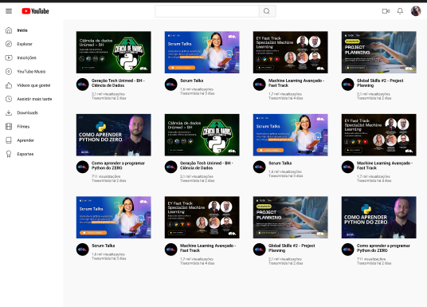

## 🧠 Aprendizados

- Alinhamento e espaçamento com `display: flex` e `display: grid`
- Como estruturar um layout responsivo com base em um design do Figma
- Boas práticas de reutilização de classes e organização de componentes

## 📷 Preview

## 📌 Observação

Este é um projeto estático, sem interatividade JavaScript, focado apenas na estrutura visual conforme o layout original do Figma.

---

👨‍💻 Desenvolvido por Marcus
